# Modernist Architecture

## Vernacular vs Modernist

Defintions:

> **Vernacular** —
	Vernacular architecture follows regional, local and traditional styles of architecture. This typically means that fine details are left in for decoration, in stark contrast to modernist architecture.  
    Here, the key design principle is following tradition — which means only the local style. This means a hose in Switzerland will look nothing like a house in England, as each follows the local style.
	

 
\pagebreak 

### Vernacular — UK

* A crucial example of the vernacular in the UK is the terraced houses seen
almost only in the UK:
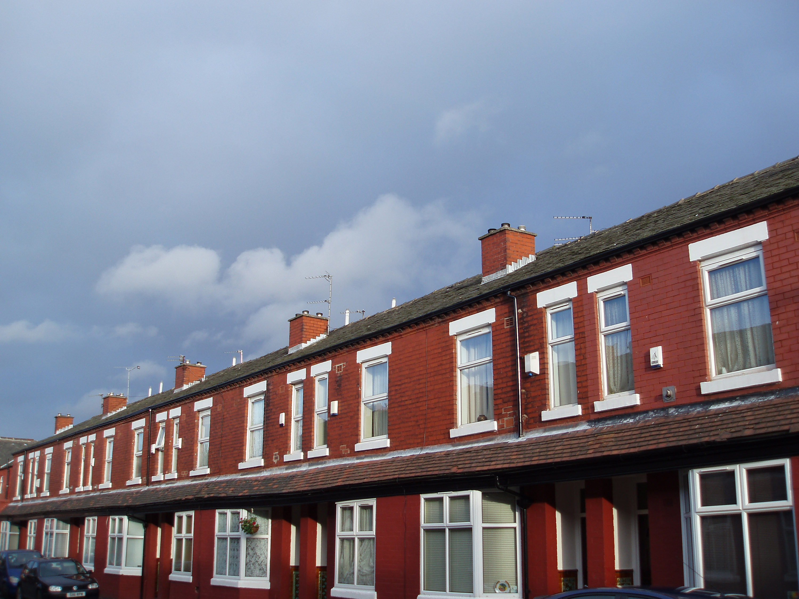
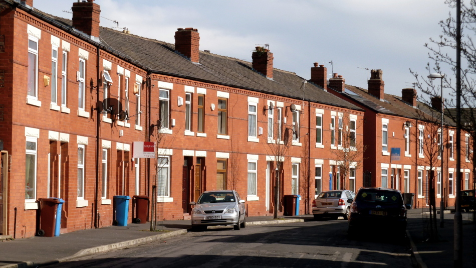
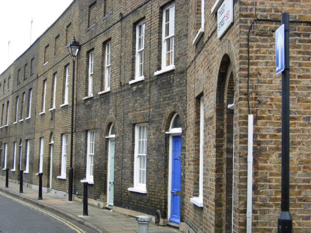

### Vernacular — Vietnam

* Vietnam has a very different style of vernacular architecture to the UK, with
  a large amount of their houses on stils because of the rainy season, and large
  sloping roofs for the same reason. The materials are also very different,
relying on hay and mud over bricks and concrete. 

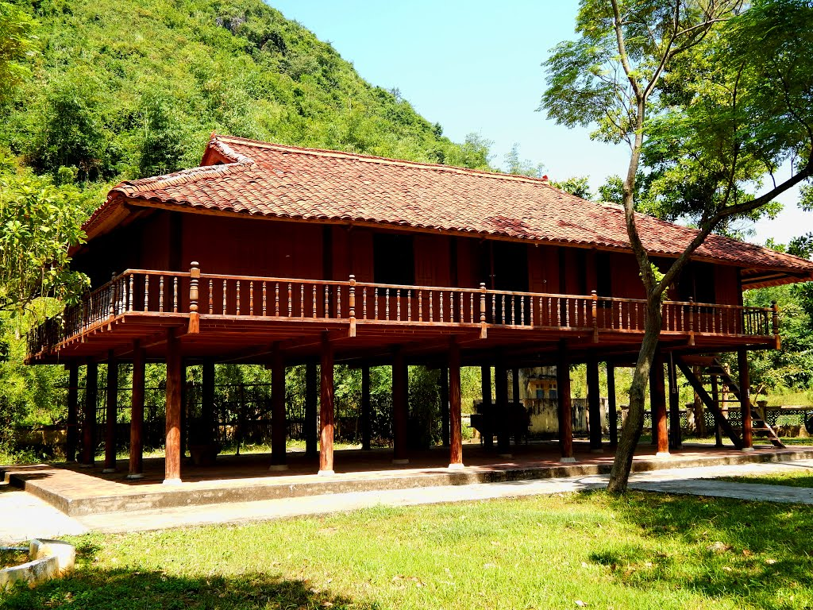
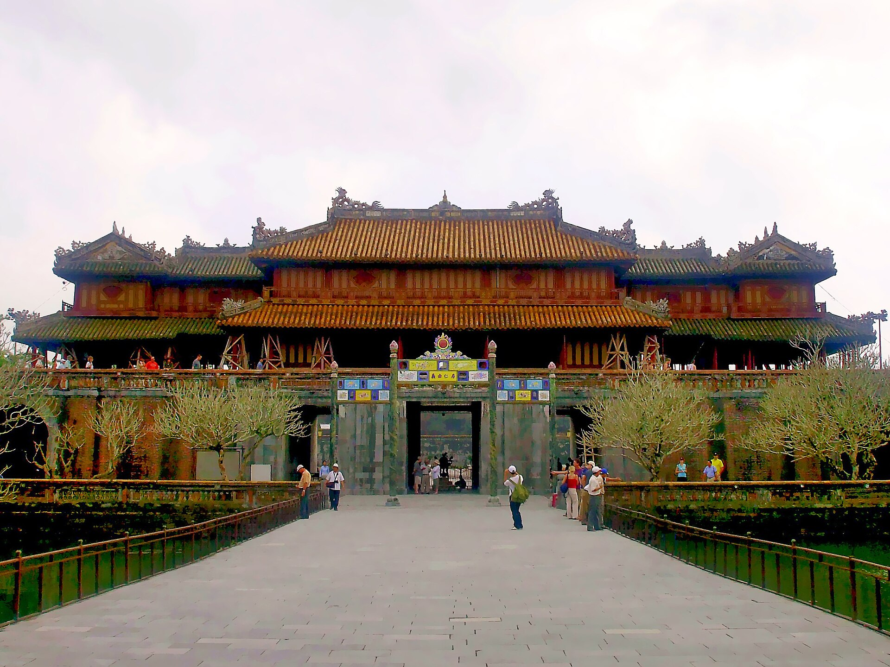
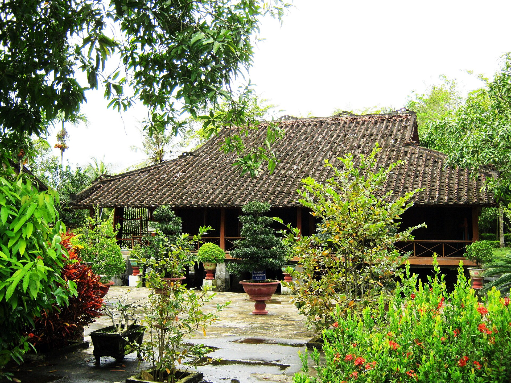

### Vernacular — Spain

* Spain too has its unique style of architecture

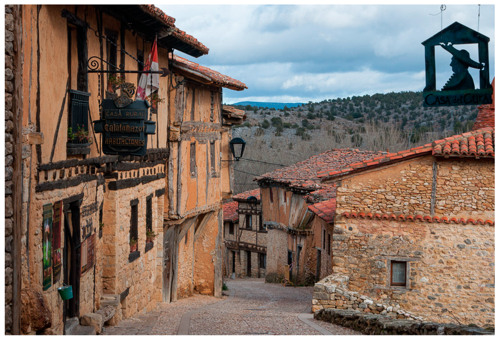

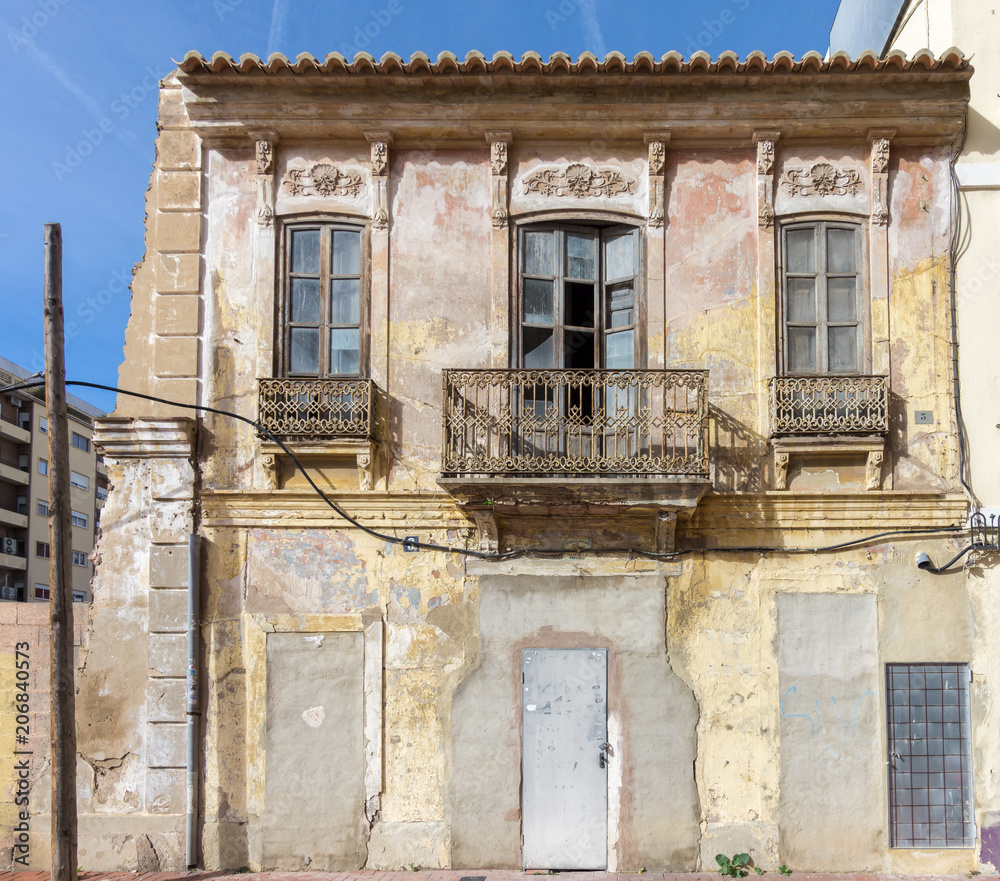

### Vernacular — South Africa

* South African employs again a very different style, mostly huts made of hay
and wooden sticks

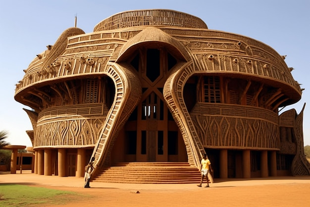

---
> **Modernist** —   
	Modernist architecture is following the modernism movement — from traditional forms of art towards more abstract forms. Specifically in architecture, it means to simplify and ‘streamline’ the architecture, which would remove most decorative details instead choosing to replace them with straight edges and right angles. The primary design idea is 'form follows function' — Louis Sullivan, and predicting and designing everything around the function, so how it would be used, and then, only later, if neccessary to add form.

## Bauhaus of Dessau (timeline)

Designed by __Walter Gropius__ (1883 — 1969)

* Began in 1919 in Weimar, Gropius founded the Bauhaus movement
  
  * This movement aimed to reconcile art and crafts to create a new industrial aesthetic, what we now call design — specifically modernism
    * Modernism was crucial to the Bauhaus, and the Bauhaus is built around it.
    
    * This included everything, from metalworking to painting but also performances such as dance and stagecraft. Here furniture was designed as well.

* In 1925, the far right won the elections in Weimar and shut down the school.
  
  * In Dessau, the city council released funds for the construction of the Bauhaus
  * Dessau was an ideal location for the Bauhaus due to its strong industry
  * Land was made available for Gropius in a relatively isolated area, separated from town

### Design of the Bauhaus
  
  * #### Sections of the Bauhaus
    
    * ###### The Higher Academy for the Arts
      
      * A parallelepiped that houses the large Bauhaus workshops. 
      * Given every opportunity for expansion — with no partitions to give it an impression of enclosure
      * Designed to be the most powerful element of the project — an image that would mark people
    
    * ###### Area for the Administrative Department and Director's office
      
      * Center of the building
      * Linking the two schools: the Bauhaus and its workshops and the Technical school
      * Two story construction of the bridge also housing the most prized workshop in the school — the architecture workshop
        * This bridge would be built on stilts — highlighting the fashionable cubist idea of interpenetration of space
      
          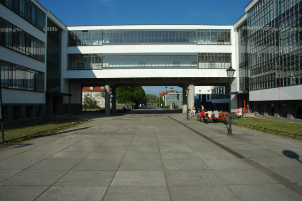

    * ###### A collective area with a theater and a refractory
      
      * Where the students of the technical school, those of the art school and the teachers could meet 
      * A place of performance, leisure and encounters

    
    * ###### Studio accommodation for the students
      
      * This has 24 student flats on four floors — the highest section of the building
      * Rooms extend out onto tiny balconies — that provide the feeling of additional space
      
      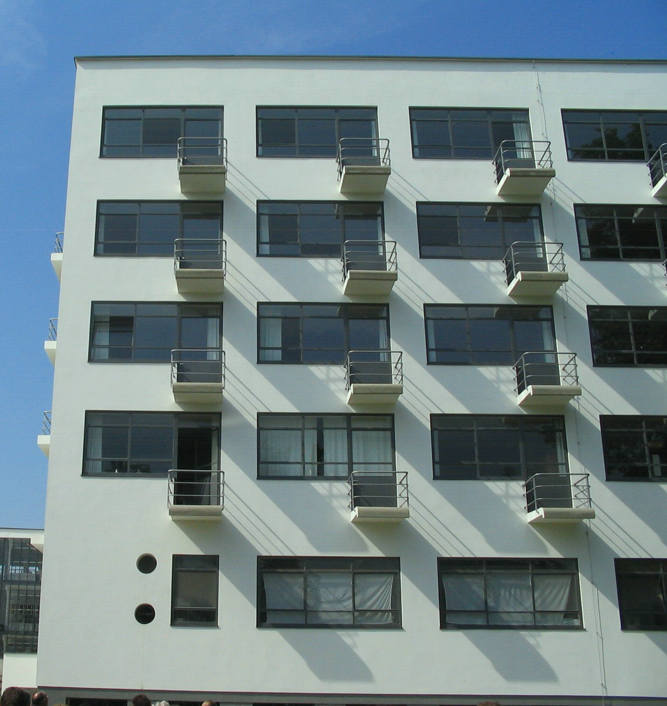
    
    * ###### Housing for the teachers
      
      * Self Explanatory
      
      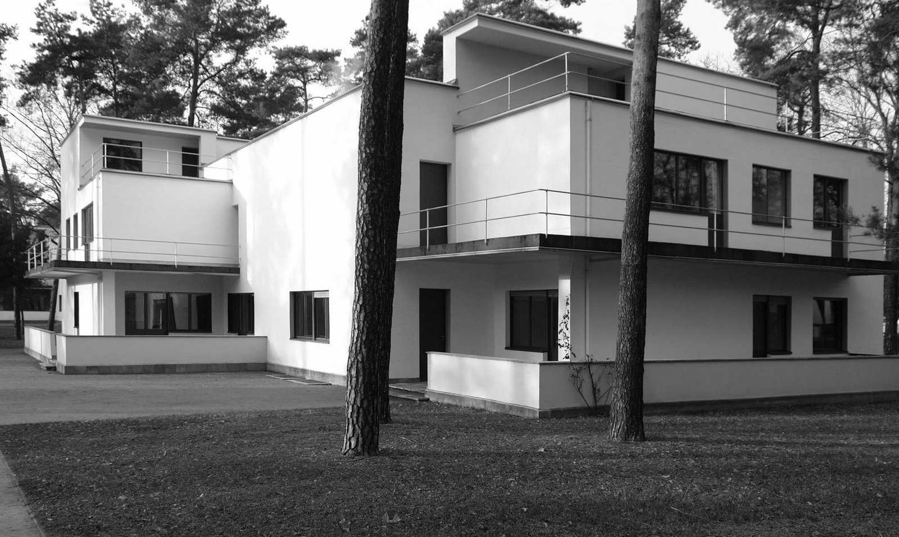
    
    * ###### Technical school to train young apprentices (as requested by the Dessau City Council)
      
      * No glass walls here, these were classrooms so the windows were placed high so as not to distract the students
      * Less prestigious here

  
  * ##### Orientation of the Bauhaus
    
    * Gropius had to decide on the orientation of the building, now having drawn out an outline for it 
    * He chose to make it so that the sun in the summer would wake the students, reminding them of their first duty: a harmonious relationship with nature 
    * He would then locate the leading parallelepiped of the main workshop between east and west — making it so that all day long the workshops would be flooded with light. This unintentionally made it a greenhouse due to the glass walls
    * Finally he gave the technical school the final rays of light

* The "Glass Curtain" of the workshop bearing no weight was already partially tested in the 'faggus factory' built with Adolf Meyer 
  
  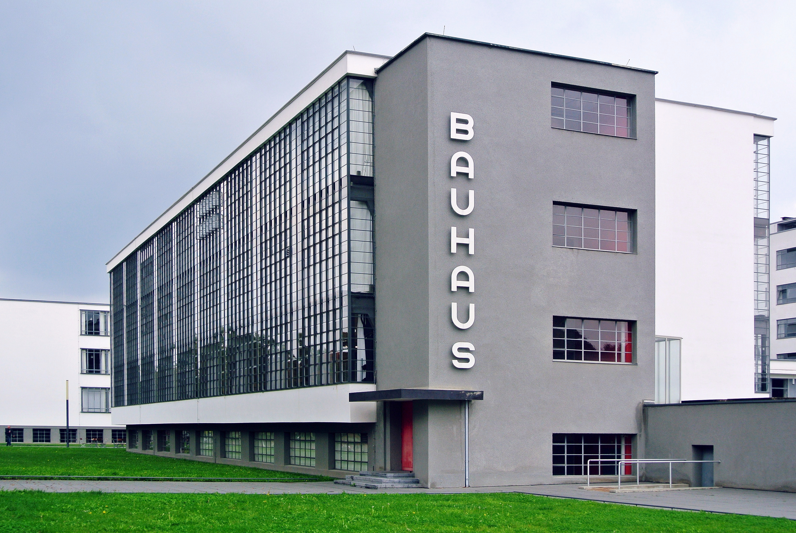

* America was is inspiration from this — industrial design from here, for example:
  
  * The grain silos of Canada and South America
  
  * The coal silos of the huge railway lines
  
  * The most modern workshops of the North American companies
    
    * Here Gropius was free to place them how he liked, and chose for an interlinked structure in a deliberately asymmetric form
    * To truly understand the building and its subsequent parts one must walk around, and walk around to find the discreet entrance — which is against classical architecture where the central door is the most central part of the building 

* ### Construction of the Bauhaus
  
  * It was built in just over a year — very short period as a point needed to be proved
  * Gropius used assembly lines on the worksites — copying Ford's ideas here

* December 4th, 1926, inauguration of the Bauhaus
  
  * Theatrical performances followed over the next two days
  * Thousands of people came to watch this

* At 43, the Architect, Walter Gropius was also its director
  
  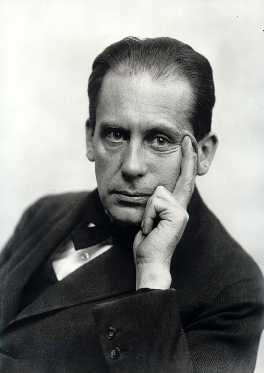

* ### Modernism in the Bauhaus

    * Here this would mean that: 
        * Useage of simpler shapes in design, elimiation of decorative features
            * So rectangles and spheres are almost entirely the design
        * Rounding off corners for the building, furniture inside the building,
          and walls inside the building are too often rounded off
        * However some are characterised by rectangular features, such as those
          seen in the protruding balconies
        * Perhaps the most important modernist principle of "form
        follows function", where everything is designed purely through
        the lens of how it should be used, ignoring the form of it.

    * ##### Materials in Modernism, as seen through the Bauhaus

        * Material use in modernism makes use of the idea   
        _"truth to materials"_  
        and  
        _"material honestry"_  
        Now what does this mean?  
        The concept behind it is, that when you use a material, you should for a
        reason, and explicitly show that you use that material.  
        So, if you make a steel pillar, don't hide that fact you are using
        concrete, you shouldn't paint over it, or try to disguise the fact that
        you are using steel, but instead show off that you are using steel by
        leaving it bare.  
        We clearly see this design concept being used when we look at th
        bauhaus:
            We have the glass curtain with aluminium and steel reinforcements.
        Just by looking at it we know what material it is — which is the point

        * Concrete examples of materials /* ba dum tsch */
            * In the Bauhaus there were several key materials used:  
            * Steel — this was a material for _power_, showing strenth in the builiding.  
            * Glass — this was to create a sense of transparency, and letting
            light pour into the building
            * Concrete — this was to create the industrial asthetic and beauty
            of raw materials, as well as
              to create the sense strength, helping the Steel

## Sea Lane House

* Built by Marcel Breuer in 1936

    * Marcel was trained by the Bauhaus — hense the architecture styles both modernist

* It was located in the UK
    * In East Preston, West Sussex

* Heavily inspired by the Bauhaus, the Sea Lane house is also a key example and crucial building in the modernist movement
